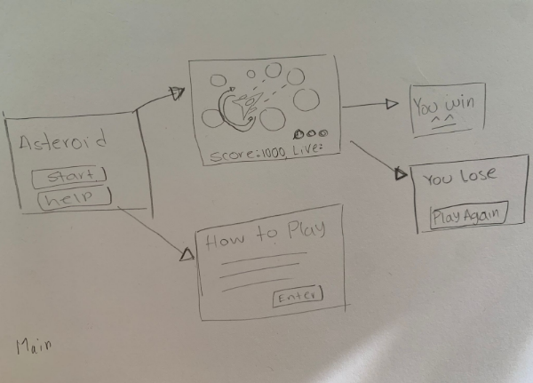

# Asteroid Game 
[a description of the program]

## Project Structure
---
The project files and folders are organized as follows:
```
root                    (project root folder)
+-- docs                (project documentation)
+-- rename              [src code files - rename for project]
  +-- assets            (program asset files)
  +-- data              (program data files)
  +-- __init__.py       (python package file)
  +-- __main__.py       (entry point for program)
+-- LICENSE             (license file)
+-- README.md           (general info)
```
## Project run 
you can start the game with the follow code. 

```
cd rename
cd game 
python director.py
```


## Required Technologies
---
to run the project you need to use the enviromento  
  ```
  source env/bin/activate
  ```
to use all the packages we use in the project.

## Authors

Daniel Martinez 
Carlos Gaibor

# Planning Guide 

### Overview

This project will be called Asteroid, a spacecraft shooting asteroids, surviving against collisions that threaten to destroy the space shift. In this project we are going to use the concepts learned during the semester. i.e. classes, encapsulation, polymorphism, arcade, and random modules. 


### Mock-ups




The Asteroid game is going to show a menu bar when it begins to run. that buttons are “Start Game” and “Help” in the help button shall explain the controls and the foes to defeat. The buttons in use shall be “up”, “down”, “left”, “right” arrows to move around the field, and “spacebar” to fire the main laser weapon. 
The game begins by pushing the start button, the score begins with zero points and increases destroying the asteroids that appear randomly around the spacecraft, the frequency of the asteroids and their size shall increase with time, and of course, the number of shots to destroy them, when the asteroid get destroy the asteroid fragment in small pieces, that can destroy the spaceship. 
Our spaceship will have three lives and the score bar is going to be ubicated at the top right of the display. 
If the player reaches a score of a hundred thousand points the player wins, otherwise a display shall appear with a “Game Over” message and a button to play again.


### Wish List:

This is the wish list of the features 

Main scene: 
play button 
help button 

##### Game scene: 
spaceship 
The spaceship has the capability of movement front, back, left and right. 
The spaceship need to fire bullets.
The bullets need to destroy the asteroids. 
Asteroids get destroyed and split in small fragments.
When the spaceship is touched by the asteroid, it destroys the spaceship.  
In the case of the asteroids they shall appear randomly but with time the difficulty in evading or destroying will increase.

##### Score display 
Life display 
life is limited by 3 
Sound effects

##### Help scene : 
help text 
Back button 

##### Win scene 
your score
You win ! Sign

##### Lose scene 
Play again button 
Game over 
Note or text 
sound of “game over”

### Feature list: 

This feature list to create a prioritize feature list, and is rank in base of his importance, this game have 2D graphics but one of the top priorities are functionality of the spacecraft the feature list is as follows: 
(1)means top priority
(2)means middle priority
(3)means lowest priority

##### (2)Main scene: 
(2)play button 
(3)help button 

##### (1)Game scene: 
(1)spaceship 
(1)The spaceship has the capability of movement front, back, left and right. 
(1)The spaceship need to fire bullets
(1)The bullets need to destroy the asteroids. 
(1)Asteroids get destroyed and split into small fragments.
(2)When the spaceship is touched by the asteroid, it destroys the spaceship.  
(1)In the case of the asteroids they shall appear randomly but with time the difficulty in evading or destroying will increase.
(2)Score display 
(3)Life display 
(3)life is limited by 3 
(3)Sound effects

##### (2)Help scene : 
(3)help text 
(2)Back button 

##### (3)Win scene 
(2)your score
(3)You win ! Sign

##### (3)Lose scene 
(3)Play again button 
(2)Game over 
(3)Note or text 
(3)sound of “game over” 

### Summary

In resume, this guide provides the information to apply in the debugging of the Asteroid game, The game’s mock-up, The Feature lists, and The prior classes orderly on the scale of 1 to 3 in the base of the priority. 

  
#### GitHub repo
https://github.com/iodaniel/cse210-project


